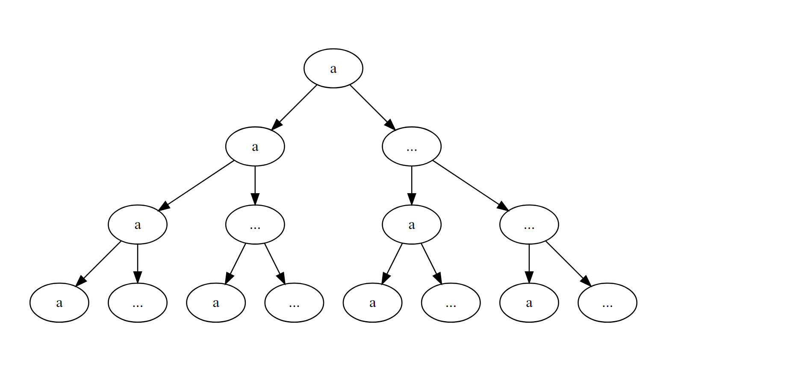
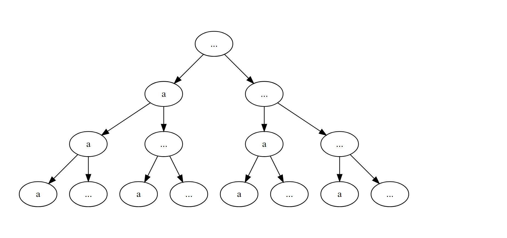

# Encoding fixed-length strings with tree-based method from a dictionary

**Author**: Xiurui Zhu<br /> **Modified**: 2021-11-26 16:12:36<br />
**Compiled**: 2021-11-26 16:12:38

## Introduction

This paper introduced a pipeline to encode strings of fixed length with
tree-based method from a dictionary.

## Question

Suppose there are some strings of length 4. We need to encode them from
a dictionary of small letters `a-y`. The code starts from 0 for `a`,
then 1 for `aa`, 2 for `aaa`, 3 for `aaaa`, …, then `aab`, `aaba`, …,
`b`, … Develop a function to convert strings to their corresponding
codes. For example, with strings of length 4, `baca` should be encoded
as `16331`.

## Solution

We attempt this question with tree-based method. A series of 4-layered
trees is built so that the first layer contains `a-y` and for each node
there are branches to `a-y` in the next layer until the trees reach
their designated number of layers. The code for the string is the number
of nodes in total to the left of the path (including the nodes on the
path) minus 1, since it is 0-based. Please note the possible missing
characters while counting the nodes.

``` r
library(tidyverse)
#> -- Attaching packages --------------------------------------- tidyverse 1.3.1 --
#> v ggplot2 3.3.5     v purrr   0.3.4
#> v tibble  3.1.3     v dplyr   1.0.7
#> v tidyr   1.1.3     v stringr 1.4.0
#> v readr   2.0.1     v forcats 0.5.1
#> -- Conflicts ------------------------------------------ tidyverse_conflicts() --
#> x dplyr::filter() masks stats::filter()
#> x dplyr::lag()    masks stats::lag()
library(data.tree)
gen_code_tree_list <- function(name = "Root", dictionary, max_depth) {
  if (max_depth >= 1L) {
    list(
      name = name,
      children = dictionary %>%
        purrr::map(~ gen_code_tree_list(.x, dictionary, max_depth - 1L))
    )
  } else {
    list(name = name)
  }
}
gen_code_tree <- function(node, dictionary, max_depth) {
  dictionary %>%
    purrr::map(~ {
      gen_code_tree_list(name = .x, dictionary, max_depth - 1L) %>%
        data.tree::FromListExplicit()
    })
}
code_tree <- gen_code_tree(code_tree,
                           c("a", "..."),
                           max_depth = 4L)
file.path("README_files", paste0("tree_", 1:2, ".png")) %>%
  knitr::include_graphics()
```



The computation formula is as follows, where *n* stands for number of
digits, *l* stands for the length of dictionary and *p* stands for the
positions of digits in the dictionary:


We develop the encoding function as follows:

``` r
#' @param str String vector to encode
#' @param digit Number of digits for encoding
#' @param dictionary Dictionary for each character, starting from 1
encode_str <- function(str, digit, dictionary) {
  # Check if all strings are in the length of digits
  stopifnot(all(nchar(str) <= digit))
  # Extract positions of each character in each string
  digit_idx <- str %>%
    stringr::str_extract_all(".") %>%
    purrr::map(~ {
      result <- .x %>%
        factor(levels = dictionary) %>%
        as.integer()
      # Add missing letters as 0 nodes to count
      if (length(result) < digit) {
        missing_digits <- digit - length(result)
        result <- c(result, rep(0L, missing_digits))
      }
      result
    })
  # Check validity of each string against out-of-dictionary characters
  invalid_lgl <- digit_idx %>%
    purrr::map_lgl(~ any(is.na(.x)))
  if (any(invalid_lgl == TRUE)) {
    stop("Invalid string: ", paste(str[invalid_lgl == TRUE], collapse = ", "))
  }
  
  # Output code for each string
  digit_idx %>%
    purrr::map_dbl(function(digit_idx_one) {
      (
        purrr::map_dbl(seq_len(digit), function(x) {
          (
            # Sum the nodes in the trees to the left on current layer
            purrr::map_dbl(seq_len(x - 1L), function(y) {
              # Count the nodes on each layer
              # Limit the minimal node count to 0 to handle missing characters
              max(digit_idx_one[y] - 1, 0) * length(dictionary)^(x - y)
            }) %>%
              purrr::reduce(sum, .init = 0)
          ) +
            # Add the nodes to the left in the tree of current path 
            digit_idx_one[x]
        }) %>%
          # Sum the nodes from different layers
          purrr::reduce(sum, .init = 0)
      )
    }) -
    # Turn the code to 0-based
    1
}
```

Then we test the function with some imputs.

``` r
# Define encoding digits and dictionary (a-y)
digit <- 4L
dictionary <- letters[-length(letters)]

# Test with some starting entries
test_str0 <- c("a", "aa", "aaa", "aaaa", "aaab")
encode_str(test_str0, digit, dictionary)
#> [1] 0 1 2 3 4

# Test with the real example
test_str <- c("baca")
encode_str(test_str, digit, dictionary)
#> [1] 16331

# Test some erroneous inputs
encode_str("aaabb", digit, dictionary)
#> Error in encode_str("aaabb", digit, dictionary): all(nchar(str) <= digit) is not TRUE
encode_str(c("abs", "abz"), digit, dictionary)
#> Error in encode_str(c("abs", "abz"), digit, dictionary): Invalid string: abz
```
